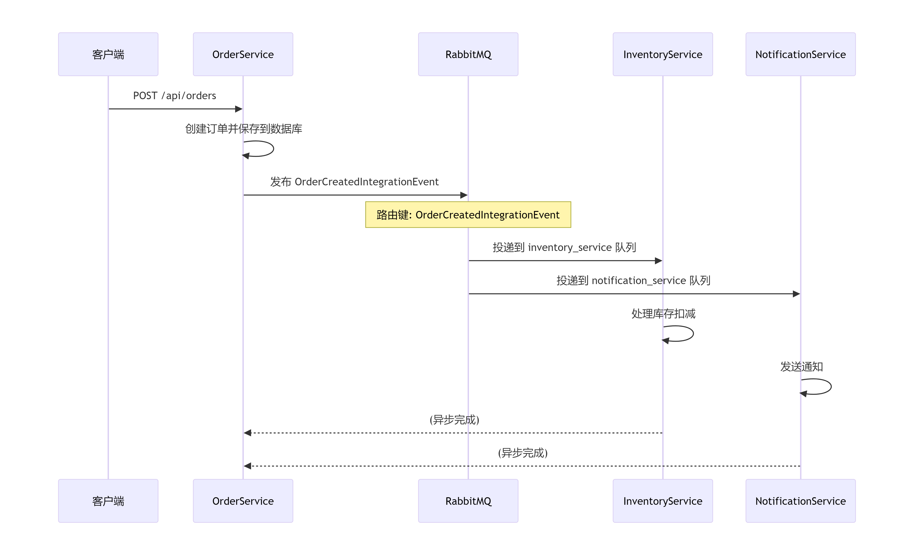
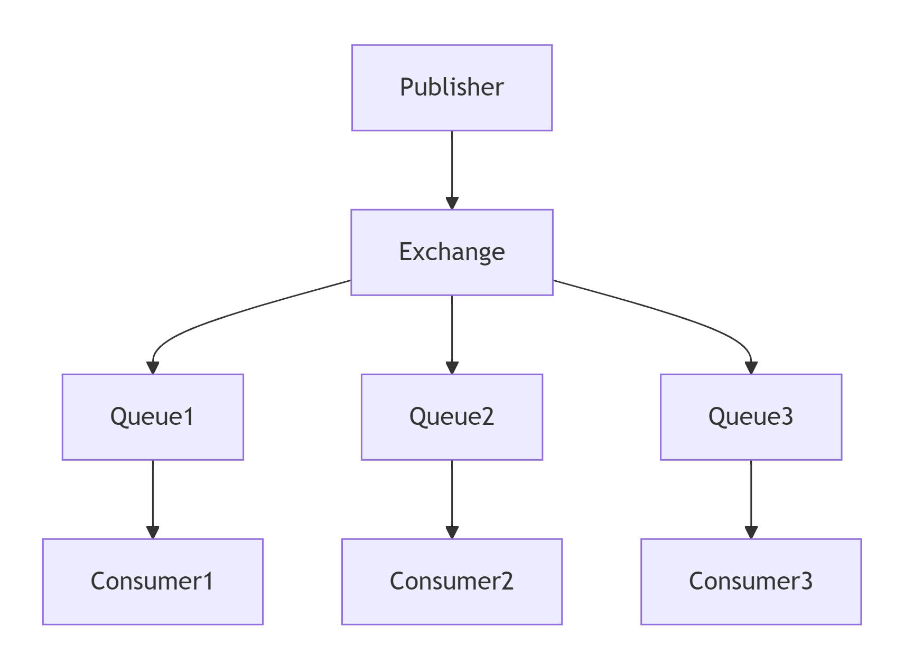

# 我虽然大体理解了 设计的原理，但是具体应用还是有差距。我想继续了解一下，应用场景呀，你提到的分布式系统概念我先放一下之后再讨论，不同微服务之间是如何做到的呢，如何发布消息，如何订阅这个消息，如何接受消息

# 微服务间通信的完整流程

场景：电商系统中的订单创建
假设我们有三个微服务：

OrderService（订单服务）

InventoryService（库存服务）

NotificationService（通知服务）

1. 项目结构和共享契约
   共享类库（可选但推荐

```

// Shared.Contracts/Events/OrderCreatedIntegrationEvent.cs
namespace Shared.Contracts.Events
{
    public class OrderCreatedIntegrationEvent : IntegrationEvent
    {
        public int OrderId { get; set; }
        public string CustomerId { get; set; }
        public DateTime OrderDate { get; set; }
        public List<OrderItem> Items { get; set; } = new();
        public decimal TotalAmount { get; set; }

        public OrderCreatedIntegrationEvent(int orderId, string customerId, DateTime orderDate, decimal totalAmount)
        {
            OrderId = orderId;
            CustomerId = customerId;
            OrderDate = orderDate;
            TotalAmount = totalAmount;
        }
    }

    public class OrderItem
    {
        public int ProductId { get; set; }
        public string ProductName { get; set; } = string.Empty;
        public int Quantity { get; set; }
        public decimal UnitPrice { get; set; }
    }
}
```

2. OrderService（发布者
   发布事件的业务代码

```
// OrderService/Application/Commands/CreateOrderCommandHandler.cs
public class CreateOrderCommandHandler : IRequestHandler<CreateOrderCommand, int>
{
    private readonly IOrderRepository _orderRepository;
    private readonly IEventBus _eventBus;
    private readonly ILogger<CreateOrderCommandHandler> _logger;

    public CreateOrderCommandHandler(
        IOrderRepository orderRepository,
        IEventBus eventBus,
        ILogger<CreateOrderCommandHandler> logger)
    {
        _orderRepository = orderRepository;
        _eventBus = eventBus;
        _logger = logger;
    }

    public async Task<int> Handle(CreateOrderCommand request, CancellationToken cancellationToken)
    {
        _logger.LogInformation("开始创建订单 - 客户: {CustomerId}", request.CustomerId);

        // 1. 创建订单实体
        var order = new Order
        {
            CustomerId = request.CustomerId,
            OrderDate = DateTime.UtcNow,
            Status = OrderStatus.Pending,
            Items = request.Items.Select(item => new OrderItem
            {
                ProductId = item.ProductId,
                ProductName = item.ProductName,
                Quantity = item.Quantity,
                UnitPrice = item.UnitPrice
            }).ToList()
        };

        // 2. 保存订单到数据库
        await _orderRepository.AddAsync(order);
        await _orderRepository.SaveChangesAsync();

        _logger.LogInformation("订单创建成功 - 订单ID: {OrderId}", order.Id);

        // 3. 发布订单创建事件
        var orderCreatedEvent = new OrderCreatedIntegrationEvent(
            orderId: order.Id,
            customerId: order.CustomerId,
            orderDate: order.OrderDate,
            totalAmount: order.Items.Sum(item => item.Quantity * item.UnitPrice)
        )
        {
            Items = order.Items.Select(item => new Shared.Contracts.Events.OrderItem
            {
                ProductId = item.ProductId,
                ProductName = item.ProductName,
                Quantity = item.Quantity,
                UnitPrice = item.UnitPrice
            }).ToList()
        };

        _eventBus.Publish(orderCreatedEvent);

        _logger.LogInformation("订单创建事件已发布 - 订单ID: {OrderId}", order.Id);

        return order.Id;
    }
}
```

OrderService 的 Startup 配置

```

// OrderService/Startup.cs
public class Startup
{
    public void ConfigureServices(IServiceCollection services)
    {
        // 注册 EventBus（只发布，不订阅）
        services.AddSingleton<IRabbitMQPersistentConnection>(sp =>
        {
            var logger = sp.GetRequiredService<ILogger<DefaultRabbitMQPersistentConnection>>();
            var factory = new ConnectionFactory()
            {
                HostName = Configuration["RabbitMQ:Host"],
                UserName = Configuration["RabbitMQ:Username"],
                Password = Configuration["RabbitMQ:Password"],
                DispatchConsumersAsync = true
            };
            return new DefaultRabbitMQPersistentConnection(factory, logger);
        });

        services.AddSingleton<IEventBus, EventBusRabbitMQ>(sp =>
        {
            var rabbitMQConnection = sp.GetRequiredService<IRabbitMQPersistentConnection>();
            var logger = sp.GetRequiredService<ILogger<EventBusRabbitMQ>>();
            var subsManager = sp.GetRequiredService<IEventBusSubscriptionsManager>();

            return new EventBusRabbitMQ(rabbitMQConnection, logger, subsManager,
                queueName: "order_service", retryCount: 5);
        });

        services.AddSingleton<IEventBusSubscriptionsManager, InMemoryEventBusSubscriptionsManager>();

        // 其他服务注册...
    }
}
```

3. InventoryService（订阅者）
   订阅和处理事件

```

// InventoryService/Application/EventHandlers/OrderCreatedIntegrationEventHandler.cs
public class OrderCreatedIntegrationEventHandler
    : IIntegrationEventHandler<OrderCreatedIntegrationEvent>
{
    private readonly IInventoryRepository _inventoryRepository;
    private readonly ILogger<OrderCreatedIntegrationEventHandler> _logger;

    public OrderCreatedIntegrationEventHandler(
        IInventoryRepository inventoryRepository,
        ILogger<OrderCreatedIntegrationEventHandler> logger)
    {
        _inventoryRepository = inventoryRepository;
        _logger = logger;
    }

    public async Task Handle(OrderCreatedIntegrationEvent @event)
    {
        _logger.LogInformation("收到订单创建事件 - 订单ID: {OrderId}, 商品数量: {ItemCount}",
            @event.OrderId, @event.Items.Count);

        try
        {
            // 1. 检查库存
            foreach (var item in @event.Items)
            {
                var inventory = await _inventoryRepository.GetByProductIdAsync(item.ProductId);
                if (inventory == null || inventory.Quantity < item.Quantity)
                {
                    _logger.LogWarning("库存不足 - 产品ID: {ProductId}, 需要: {Required}, 实际: {Actual}",
                        item.ProductId, item.Quantity, inventory?.Quantity ?? 0);

                    // 可以发布库存不足事件
                    // await _eventBus.Publish(new InventoryInsufficientIntegrationEvent(...));
                    return;
                }
            }

            // 2. 扣减库存
            foreach (var item in @event.Items)
            {
                await _inventoryRepository.ReduceInventoryAsync(item.ProductId, item.Quantity);
                _logger.LogInformation("库存扣减成功 - 产品ID: {ProductId}, 数量: {Quantity}",
                    item.ProductId, item.Quantity);
            }

            _logger.LogInformation("库存处理完成 - 订单ID: {OrderId}", @event.OrderId);
        }
        catch (Exception ex)
        {
            _logger.LogError(ex, "处理订单创建事件失败 - 订单ID: {OrderId}", @event.OrderId);
            throw;
        }
    }
}
```

InventoryService 的 Startup 配置

```
// InventoryService/Startup.cs
public class Startup
{
    public void ConfigureServices(IServiceCollection services)
    {
        // 注册 EventBus（既发布也订阅）
        services.AddSingleton<IRabbitMQPersistentConnection>(sp =>
        {
            var logger = sp.GetRequiredService<ILogger<DefaultRabbitMQPersistentConnection>>();
            var factory = new ConnectionFactory()
            {
                HostName = Configuration["RabbitMQ:Host"],
                UserName = Configuration["RabbitMQ:Username"],
                Password = Configuration["RabbitMQ:Password"],
                DispatchConsumersAsync = true
            };
            return new DefaultRabbitMQPersistentConnection(factory, logger);
        });

        services.AddSingleton<IEventBus, EventBusRabbitMQ>(sp =>
        {
            var rabbitMQConnection = sp.GetRequiredService<IRabbitMQPersistentConnection>();
            var logger = sp.GetRequiredService<ILogger<EventBusRabbitMQ>>();
            var subsManager = sp.GetRequiredService<IEventBusSubscriptionsManager>();

            return new EventBusRabbitMQ(rabbitMQConnection, logger, subsManager,
                queueName: "inventory_service", retryCount: 5);
        });

        services.AddSingleton<IEventBusSubscriptionsManager, InMemoryEventBusSubscriptionsManager>();

        // 注册事件处理器
        services.AddTransient<OrderCreatedIntegrationEventHandler>();

        // 其他服务注册...
    }

    public void Configure(IApplicationBuilder app, IWebHostEnvironment env)
    {
        // ... 其他配置

        // 订阅事件
        var eventBus = app.ApplicationServices.GetRequiredService<IEventBus>();
        eventBus.Subscribe<OrderCreatedIntegrationEvent, OrderCreatedIntegrationEventHandler>();

        _logger.LogInformation("库存服务已订阅 OrderCreatedIntegrationEvent");
    }
}
```

4. NotificationService（另一个订阅者）
   订阅和处理事件

```
// NotificationService/Application/EventHandlers/OrderCreatedIntegrationEventHandler.cs
public class OrderCreatedIntegrationEventHandler
    : IIntegrationEventHandler<OrderCreatedIntegrationEvent>
{
    private readonly IEmailService _emailService;
    private readonly ISmsService _smsService;
    private readonly ILogger<OrderCreatedIntegrationEventHandler> _logger;

    public OrderCreatedIntegrationEventHandler(
        IEmailService emailService,
        ISmsService smsService,
        ILogger<OrderCreatedIntegrationEventHandler> logger)
    {
        _emailService = emailService;
        _smsService = smsService;
        _logger = logger;
    }

    public async Task Handle(OrderCreatedIntegrationEvent @event)
    {
        _logger.LogInformation("发送订单创建通知 - 订单ID: {OrderId}, 客户: {CustomerId}",
            @event.OrderId, @event.CustomerId);

        try
        {
            // 1. 发送邮件通知
            await _emailService.SendOrderConfirmationAsync(@event.CustomerId, @event.OrderId, @event.TotalAmount);
            _logger.LogInformation("订单确认邮件已发送 - 订单ID: {OrderId}", @event.OrderId);

            // 2. 发送短信通知（可选）
            await _smsService.SendOrderNotificationAsync(@event.CustomerId, @event.OrderId);
            _logger.LogInformation("订单通知短信已发送 - 订单ID: {OrderId}", @event.OrderId);

        }
        catch (Exception ex)
        {
            _logger.LogError(ex, "发送订单通知失败 - 订单ID: {OrderId}", @event.OrderId);
            // 注意：通知失败不应该影响订单创建流程
        }
    }
}
```

NotificationService 的 Startup 配置

```
// NotificationService/Startup.cs
public void Configure(IApplicationBuilder app, IWebHostEnvironment env)
{
    // ... 其他配置

    // 订阅事件
    var eventBus = app.ApplicationServices.GetRequiredService<IEventBus>();
    eventBus.Subscribe<OrderCreatedIntegrationEvent, OrderCreatedIntegrationEventHandler>();

    _logger.LogInformation("通知服务已订阅 OrderCreatedIntegrationEvent");
}
```

# 完整的数据流

1. 事件发布流程
   

2. RabbitMQ 中的实际结构

```
Exchange: event_bus (Direct类型)

队列绑定:
- order_service 队列: 无绑定（只用于发布）
- inventory_service 队列: 绑定到 routing_key "OrderCreatedIntegrationEvent"
- notification_service 队列: 绑定到 routing_key "OrderCreatedIntegrationEvent"

消息流向:
OrderService → event_bus Exchange → 根据routing_key投递 → inventory_service + notification_service
```

3. 关键设计要点
   每个服务独立的队列

```
// 每个微服务有自己的队列名称
new EventBusRabbitMQ(..., queueName: "order_service", ...)      // OrderService
new EventBusRabbitMQ(..., queueName: "inventory_service", ...)  // InventoryService
new EventBusRabbitMQ(..., queueName: "notification_service", ...) // NotificationService
```

# 我现在有很多疑问， 关于 2. RabbitMQ 中的实际结构，属于 底层通信的过程了，发布者如何发布出去的，发布者不需要关注各种队列吗，以及订阅者 3. 关键设计要点 每个服务独立的队列 这些，请给我一些介绍

你问到了 EventBus 设计的核心问题。让我详细解释 RabbitMQ 底层通信机制和队列设计原理。

1. RabbitMQ 底层通信结构



## 在 EventBus 中的具体实现

```
public class EventBusRabbitMQ
{
    const string BROKER_NAME = "event_bus";  // Exchange 名称

    public void Publish(IntegrationEvent @event)
    {
        using (var channel = _persistentConnection.CreateModel())
        {
            // 1. 声明 Exchange（如果不存在）
            channel.ExchangeDeclare(
                exchange: BROKER_NAME,
                type: "direct",          // Direct 类型：精确匹配 routingKey
                durable: true,           // 持久化
                autoDelete: false);      // 不自动删除

            // 2. 发布消息到 Exchange
            channel.BasicPublish(
                exchange: BROKER_NAME,           // 发布到 event_bus Exchange
                routingKey: @event.GetType().Name, // 路由键 = 事件类型名称
                mandatory: true,
                basicProperties: properties,
                body: body);  // 序列化后的事件数据
        }
    }
}
```

2. 发布者如何发布（不需要关心队列）
   发布者的视角：非常简单！

```
public class OrderService
{
    private readonly IEventBus _eventBus;

    public async Task CreateOrderAsync()
    {
        // 业务逻辑...

        // 发布事件：只需要这一行代码！
        _eventBus.Publish(new OrderCreatedIntegrationEvent(orderId, customerId, items));

        // 发布者完全不知道：
        // - 有多少订阅者
        // - 订阅者是谁
        // - 消息怎么路由
        // - 有哪些队列
    }
}
```

EventBus 内部如何工作

```
public void Publish(IntegrationEvent @event)
{
    // 发布者只需要知道：
    // 1. 事件类型（决定了 routingKey）
    // 2. 事件数据

    // EventBus 内部处理所有复杂逻辑：
    // 1. 序列化事件
    // 2. 连接到 RabbitMQ
    // 3. 发布到 Exchange
    // 4. 错误处理和重试

    // 发布者完全不用关心队列！
}
```

3. 每个服务独立的队列设计
   为什么需要独立队列？

```
// ❌ 错误的做法：所有服务共享一个队列
// 问题：如果一个服务处理慢，会影响其他服务
// 问题：无法独立扩展服务

// ✅ 正确的做法：每个服务有自己的队列
new EventBusRabbitMQ(..., queueName: "order_service", ...)      // OrderService
new EventBusRabbitMQ(..., queueName: "inventory_service", ...)  // InventoryService
new EventBusRabbitMQ(..., queueName: "notification_service", ...) // NotificationService
```

队列创建的完整流程

```
private IModel CreateConsumerChannel()
{
    var channel = _persistentConnection.CreateModel();

    // 1. 声明 Exchange
    channel.ExchangeDeclare(
        exchange: BROKER_NAME,
        type: "direct",
        durable: true,
        autoDelete: false);

    // 2. 声明队列（每个服务独有的队列）
    channel.QueueDeclare(
        queue: _queueName,           // 队列名称，如 "inventory_service"
        durable: true,               // 持久化：服务重启后队列不丢失
        exclusive: false,            // 非排他：允许多个消费者
        autoDelete: false,           // 不自动删除：手动管理生命周期
        arguments: null);

    // 3. 队列绑定（在订阅时动态建立）
    // 这个绑定在 eventBus.Subscribe() 时建立
    // channel.QueueBind(queue: _queueName, exchange: BROKER_NAME, routingKey: eventName);

    return channel;
}
```

4. 完整的消息流详解

# 步骤 1：服务启动时的初始化

```
// 每个微服务启动时：
public void Configure(IApplicationBuilder app)
{
    var eventBus = app.ApplicationServices.GetRequiredService<IEventBus>();

    // 订阅感兴趣的事件
    eventBus.Subscribe<OrderCreatedIntegrationEvent, OrderCreatedIntegrationEventHandler>();

    // 内部发生什么：
    // 1. 在 _handlers 字典中记录映射
    // 2. 建立 RabbitMQ 队列绑定
}
```

RabbitMQ 中的结果：

```
Exchange: event_bus (Direct类型)

队列和绑定：
- inventory_service 队列 ← 绑定到 → OrderCreatedIntegrationEvent (routingKey)
- notification_service 队列 ← 绑定到 → OrderCreatedIntegrationEvent (routingKey)
- payment_service 队列 ← 绑定到 → OrderCreatedIntegrationEvent (routingKey)
```

# 步骤 2：事件发布时的路由

```

// OrderService 发布事件
_eventBus.Publish(new OrderCreatedIntegrationEvent(...));

// EventBus 内部：
public void Publish(IntegrationEvent @event)
{
    // routingKey = "OrderCreatedIntegrationEvent"
    channel.BasicPublish(
        exchange: "event_bus",
        routingKey: "OrderCreatedIntegrationEvent",  // 关键！
        body: serializedEvent);
}
```

RabbitMQ 的路由逻辑：

```
发布到 Exchange: event_bus, routingKey: OrderCreatedIntegrationEvent

Exchange 查找所有绑定这个 routingKey 的队列：
- inventory_service ✓ (绑定了 OrderCreatedIntegrationEvent)
- notification_service ✓ (绑定了 OrderCreatedIntegrationEvent)
- payment_service ✓ (绑定了 OrderCreatedIntegrationEvent)
- order_service ✗ (没有绑定 OrderCreatedIntegrationEvent)

结果：消息被复制3份，投递到3个队列
```

# 步骤 3：各个服务消费消息

```
// 每个服务独立消费自己的队列
private void StartBasicConsume()
{
    var consumer = new AsyncEventingBasicConsumer(_consumerChannel);

    consumer.Received += async (model, ea) =>
    {
        // ea 包含：队列名称、消息内容等
        var message = Encoding.UTF8.GetString(ea.Body.Span);

        // 处理消息（每个服务处理自己的消息副本）
        await ProcessEvent(ea.RoutingKey, message);

        // 确认消息（只确认自己队列的消息）
        _consumerChannel.BasicAck(ea.DeliveryTag, multiple: false);
    };

    // 每个服务只消费自己的队列
    _consumerChannel.BasicConsume(
        queue: _queueName,  // 如 "inventory_service"
        autoAck: false,
        consumer: consumer);
}
```

5. 实际 RabbitMQ 管理界面查看
   启动 RabbitMQ 后，访问 http://localhost:15672 可以看到：
   Exchanges 标签页：

```
Name: event_bus
Type: direct
Features: D
```

Queues 标签页：

```
Name: inventory_service
State: running
Consumers: 1
Messages: 0  (如果有未处理的消息会显示数量)

Name: notification_service
State: running
Consumers: 1
Messages: 0

Name: order_service
State: running
Consumers: 1
Messages: 0
```

Bindings 标签页：

```
Exchange: event_bus
Queue: inventory_service
Routing Key: OrderCreatedIntegrationEvent

Exchange: event_bus
Queue: notification_service
Routing Key: OrderCreatedIntegrationEvent

Exchange: event_bus
Queue: payment_service
Routing Key: OrderCreatedIntegrationEvent
```

6. 这种设计的好处
   解耦性
   解耦性
   csharp
   // 服务之间完全解耦

```
OrderService → 不知道 → InventoryService 存在
OrderService → 不知道 → NotificationService 存在
```

// 只需要知道事件契约
弹性
csharp
// InventoryService 宕机时：

- OrderService: 正常发布事件 ✅
- NotificationService: 正常接收处理 ✅
- InventoryService: 恢复后处理堆积的消息 ✅

// 消息不会丢失，RabbitMQ 会持久化
可扩展性

```
// 轻松添加新服务
public class AnalyticsService
{
    public void Configure(IApplicationBuilder app)
    {
        var eventBus = app.ApplicationServices.GetRequiredService<IEventBus>();
        eventBus.Subscribe<OrderCreatedIntegrationEvent, AnalyticsEventHandler>();
        // 新增分析服务，不影响现有系统
    }
}

// RabbitMQ 自动建立新绑定：
// analytics_service 队列 ← 绑定到 → OrderCreatedIntegrationEvent

```

# 疑问

# 对，我就是想知道 步骤 2：事件发布时的路由 这里提到了 routingKey: "OrderCreatedIntegrationEvent", // 关键！，这个很关键哈，这里已经确定了，消息进入到哪个队列，决定了，订阅人可以消费这个消息

routingKey: "OrderCreatedIntegrationEvent" 确实是整个消息路由的关键！它决定了：

哪些队列能收到消息

哪些订阅者能消费消息

消息如何被分发


# queue: \_queueName, // 服务自己的队列，如 "inventory_service" 队列的名字生命，发布者 publish 的时候是不关心的吗，他需要复制消息为几份 分别存放到不同的队列里面吧，只是我们 code 层面看不到而已，

重新组织的描述：

在 RabbitMQ 的实现中，整个消息路由机制是这样的：

1. 队列创建和绑定：当我们在代码中订阅事件时，需要指定一个队列名称。RabbitMQ 会自动帮我们创建这个队列（如果不存在），并将该队列绑定到指定的 routingKey（即事件类型名称）上。

2. 消息路由：当发布者发布消息时，只需要指定 routingKey，RabbitMQ 会自动查找所有绑定到这个 routingKey 的队列，并将消息分发到这些队列中。

3. 消息消费：每个服务从自己专属的队列中消费消息，实现了解耦和独立处理

# 问题哈 channel.ExchangeDeclare(exchange: BROKER_NAME, type: "direct"); 就是这个 中转站 BROKER_NAME，是发送方发送消息 和 订阅方 消费消息时候，他的作用

1. Exchange 的核心作用：消息路由中枢

```
const string BROKER_NAME = "event_bus";  // 这就是消息的中转站

// Exchange 的作用类似于邮局的分拣中心：
// 发送方 → 分拣中心 → 根据地址分拣 → 投递到正确的邮箱
```

2. 发送方如何使用 Exchange
   发送过程：

```
public void Publish(IntegrationEvent @event)
{
    using (var channel = _persistentConnection.CreateModel())
    {
        // 1. 确保"分拣中心"存在
        channel.ExchangeDeclare(exchange: BROKER_NAME, type: "direct");

        // 2. 把消息送到"分拣中心"，并告诉地址
        channel.BasicPublish(
            exchange: BROKER_NAME,           // 🎯 送到哪个分拣中心
            routingKey: "OrderCreatedEvent", // 🎯 消息的"收件地址"
            body: message);                  // 🎯 消息内容
    }
}
```

类比理解：

Exchange (BROKER_NAME) = 邮局分拣中心

routingKey = 收件人地址

消息 = 信件内容

3. 订阅方如何使用 Exchange
   订阅过程：

```
public void Subscribe<T, TH>()
{
    var eventName = "OrderCreatedEvent";  // 要监听的消息类型

    // 告诉分拣中心："凡是寄往这个地址的信，都放到我的邮箱里"
    _consumerChannel.QueueBind(
        queue: _queueName,           // 🎯 我的专属邮箱
        exchange: BROKER_NAME,       // 🎯 哪个分拣中心
        routingKey: eventName);      // 🎯 监听哪个地址的信件
}
```

4. 完整的数据流


具体示例：

```
// 场景：订单服务发布订单创建事件
_eventBus.Publish(new OrderCreatedIntegrationEvent(123));

// RabbitMQ 内部发生：
// 1. 消息到达 event_bus Exchange
// 2. Exchange 查找所有绑定到 "OrderCreatedIntegrationEvent" 的队列
// 3. 发现：inventory_service 队列和 notification_service 队列
// 4. 将消息复制两份，分别投递到这两个队列

// 结果：
// - InventoryService 从 inventory_service 队列收到消息
// - NotificationService 从 notification_service 队列收到消息
```
