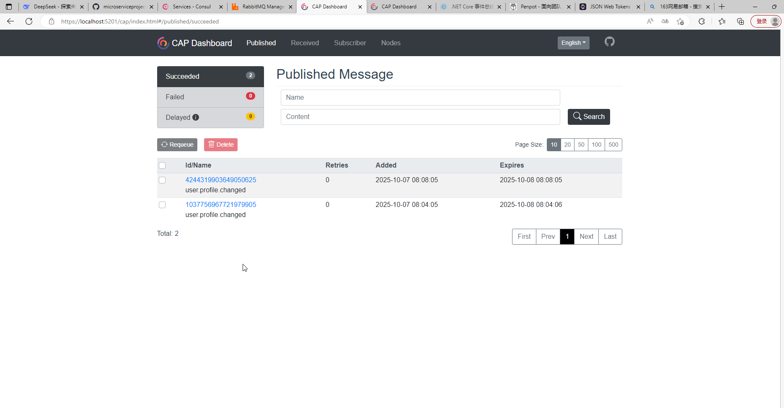

# 此处直接选用 CAP 框架来完成微服务之间的消息传递

https://www.cnblogs.com/savorboard/p/cap.html

https://github.com/dotnetcore/CAP/tree/master

## 第一步：添加 CAP 相关包

在两个项目中分别安装 CAP：

```
# 在 User.API 和 Contact.API 项目中执行：
dotnet add package DotNetCore.CAP --version 8.4.0
dotnet add package DotNetCore.CAP.RabbitMQ --version 8.4.0
dotnet add package DotNetCore.CAP.MySql --version 8.4.0
dotnet add package DotNetCore.CAP.Dashboard --version 8.4.0  # 这个需要额外加上

# 根据你的数据库选择：
# dotnet add package DotNetCore.CAP.PostgreSql
# dotnet add package DotNetCore.CAP.MySql
# dotnet add package DotNetCore.CAP.SqlServer
```

```
# 存放契约
dotnet new classlib -n Microservice.Contracts
dotnet sln add Microservice.Contracts

# 在User.API和Contact.API中执行
dotnet add reference ../Microservice.Contracts/Microservice.Contracts.csproj

```

# 代码添加完后，run 起来之后，就可以访问 dashboard 了

https://localhost:5201/cap

https://localhost:5204/cap


