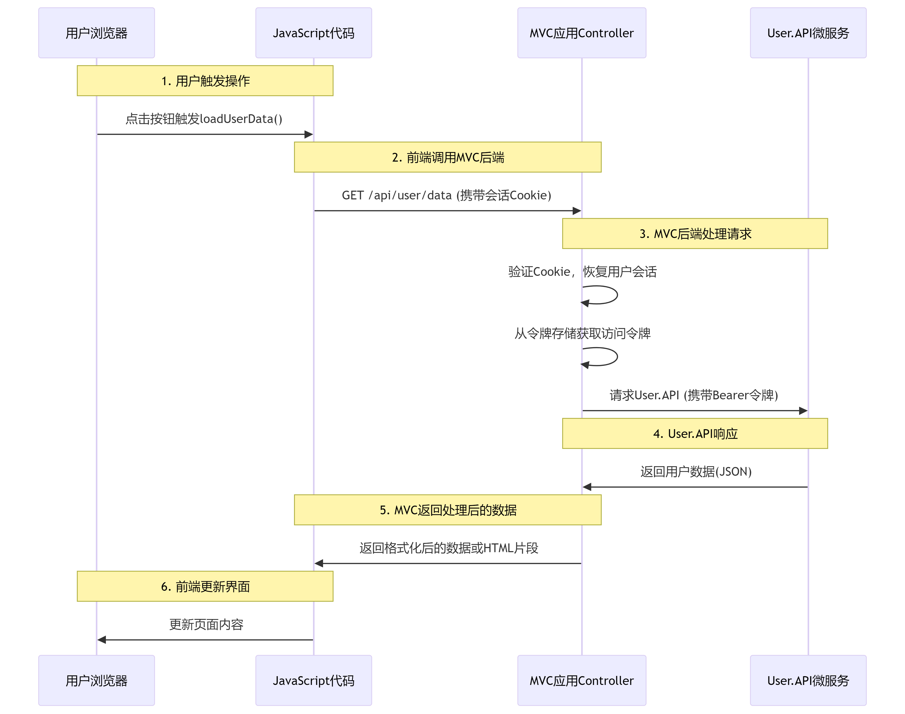

# AddJwtBearer 和 AddCookie + AddOpenIdConnect 认证流程

[用户浏览器]
→ [MVC Web 应用] (单独部署，处理 UI 渲染)
→ [各种微服务] (User.API, Contact.API 等) 这个，


架构组件职责

1. MVC Web 应用（前端聚合层）

- 职责：用户界面渲染、会话管理、路由转发

- 认证方式：AddCookie + AddOpenIdConnect

- 特点：有状态，维护用户会话

2. 后端微服务（User.API, Contact.API 等）

- 职责：提供专用的业务能力 API

- 认证方式：AddJwtBearer

- 特点：无状态，只验证令牌

3. IdentityServer（认证中心）

- 职责：统一认证和令牌颁发

- 特点：所有组件都信任的安全令牌服务

# MVC Web 应用的关键配置

```
// MVC应用的Startup.cs
services.AddAuthentication(options =>
{
    options.DefaultScheme = CookieAuthenticationDefaults.AuthenticationScheme;
    options.DefaultChallengeScheme = OpenIdConnectDefaults.AuthenticationScheme;
})
.AddCookie(options =>
{
    options.Cookie.HttpOnly = true;
    options.Cookie.SecurePolicy = CookieSecurePolicy.Always;
    options.ExpireTimeSpan = TimeSpan.FromHours(8);
})
.AddOpenIdConnect(options =>
{
    options.Authority = "https://localhost:5002";
    options.ClientId = "mvc_client";
    options.ClientSecret = "mvc_secret";
    options.ResponseType = "code";

    options.Scope.Clear();
    options.Scope.Add("openid");
    options.Scope.Add("profile");
    options.Scope.Add("user_api");
    options.Scope.Add("contact_api");

    options.SaveTokens = true; // 关键：保存令牌
    options.GetClaimsFromUserInfoEndpoint = true;

    // 令牌自动失效处理
    options.Events = new OpenIdConnectEvents
    {
        OnRedirectToIdentityProvider = context =>
        {
            // 自动处理令牌过期重定向
            return Task.CompletedTask;
        }
    };
});
```

# 后端微服务配置

```
// User.API/Contact.API的Startup.cs
services.AddAuthentication(JwtBearerDefaults.AuthenticationScheme)
    .AddJwtBearer(options =>
    {
        options.Authority = "https://localhost:5002";
        options.TokenValidationParameters = new TokenValidationParameters
        {
            ValidateAudience = true,
            ValidAudiences = new[] { "user_api", "contact_api" },
            ValidateIssuer = true,
            ValidIssuer = "https://localhost:5002"
        };
    });
```

# MVC 应用中的令牌使用示例

```
// 封装一个通用的API调用服务
public class ApiClientService
{
    private readonly IHttpContextAccessor _httpContextAccessor;
    private readonly HttpClient _httpClient;

    public ApiClientService(IHttpContextAccessor httpContextAccessor, HttpClient httpClient)
    {
        _httpContextAccessor = httpContextAccessor;
        _httpClient = httpClient;
    }

    public async Task<T> GetFromApiAsync<T>(string apiUrl)
    {
        var token = await _httpContextAccessor.HttpContext.GetTokenAsync("access_token");

        var request = new HttpRequestMessage(HttpMethod.Get, apiUrl);
        request.Headers.Authorization = new AuthenticationHeaderValue("Bearer", token);

        var response = await _httpClient.SendAsync(request);
        response.EnsureSuccessStatusCode();

        return await response.Content.ReadFromJsonAsync<T>();
    }
}

// 在控制器中使用
public class UserController : Controller
{
    private readonly ApiClientService _apiClient;
    private readonly ILogger<UserController> _logger;

    public UserController(ApiClientService apiClient, ILogger<UserController> logger)
    {
        _apiClient = apiClient;
        _logger = logger;
    }

    public async Task<IActionResult> Profile()
    {
        try
        {
            // 调用User.API获取用户数据
            var userData = await _apiClient.GetFromApiAsync<UserProfile>("https://user-api/api/users/profile");

            // 调用Contact.API获取联系人数据
            var contacts = await _apiClient.GetFromApiAsync<List<Contact>>("https://contact-api/api/contacts");

            var viewModel = new ProfileViewModel
            {
                User = userData,
                Contacts = contacts
            };

            return View(viewModel);
        }
        catch (Exception ex)
        {
            _logger.LogError(ex, "获取用户资料失败");
            return RedirectToAction("Error");
        }
    }
}
```

# 你给的完整认证流程， 第二阶段哈，我有很多疑问，当用户发送 API 请求的时候，用户是如何发送的呢，请求的是 web 应用的后端吗，web 应用从令牌存储获取令牌，继续发送 http 请求去请求 user.API 吗，然后 API 中走 JWT 认证

您问到了最核心的部分！您对这些流程的疑问非常到位，让我为您详细拆解第二阶段（API 访问阶段）的完整过程。


# function loadUserData() {

    // 这个请求仍然发送到MVC后端，不是直接调用API
    fetch('/api/user/data')
        .then(response => response.json())
        .then(data => {
            // 更新页面部分内容
            document.getElementById('user-info').innerHTML = data.html;
        });

}前端去访问自己 web 应用的后端 controller 呗，而不是 直接发送令牌去访问 User.API 哈

```
function loadUserData() {
    // 这个请求发送到MVC应用自己的后端，不是直接调用User.API
    fetch('/api/user/data')  // ← 注意这个URL是相对路径，指向MVC应用本身
        .then(response => response.json())
        .then(data => {
            document.getElementById('user-info').innerHTML = data.html;
        });
}
```


为什么这样设计？

1. 安全性（最主要原因）
   访问令牌永远不会暴露给浏览器

浏览器只需要维护会话 Cookie，不知道也不处理 JWT 令牌

减少了 XSS 攻击导致令牌被盗的风险

2. 架构清晰
   前端只与 MVC 应用通信，不知道后端微服务的存在

MVC 应用作为 API 网关，统一处理所有后端调用

微服务地址变更、版本更新等不影响前端代码

3. 更好的控制
   MVC 应用可以在调用 API 前进行额外的业务逻辑验证

可以实现缓存、重试、降级等机制

统一错误处理和日志记录

# 总而言之，就是 MVC 应用和 Identity Server 之间 会有交互来处理登录的问题，这个问题我们之后讨论

# 我先介绍一下我现在有的东西哈，有 Contact.API 和 User.API ， API.Gateway 网关, User.Identity 认证中心，Gateway 中配置了各种路由的配置，我现在的问题是，MVC web 应用中会得到令牌，去请求 User.API，实际上需要请求的是网关吧，不能直接请求 User.API 的端口吧

您完全正确！在您的架构中，MVC Web 应用不应该直接请求 User.API 的端口，而是应该通过 API 网关来访问所有后端服务。这是微服务架构中的标准做法，也是您设置 API 网关的主要目的。

为什么必须通过网关访问
统一入口点：网关提供单一入口，简化客户端配置

集中认证：网关处理所有认证和授权，微服务只需验证令牌

服务发现：网关知道如何路由到正确的服务实例

负载均衡：网关可以在多个服务实例间分配负载

安全性：内部服务不直接暴露给外部网络

# 对，首先给我的第一个感觉是 ，如果调用网关了话，地址比较统一，容易管理一些，但是如果直接调用各个微服务，那就很多地址端口等，不好控制了

！这正是使用 API 网关的核心优势之一。让我详细阐述一下通过网关统一访问微服务的好处，以及为什么直接调用各个微服务会带来问题。
通过网关访问的优势

1. 统一管理和配置
2. 简化客户端配置
   MVC 应用只需要知道一个地址（网关地址），而不是所有微服务的地址和端口。这在微服务数量增加时尤其重要。
3. 动态服务发现和负载均衡
   网关可以集成服务发现机制（如 Consul），自动发现可用的服务实例并进行负载均衡，而客户端无需关心这些细节。

4. 统一的认证和授权
   所有认证逻辑集中在网关处理，微服务可以专注于业务逻辑而不需要重复实现认证机制。

5. 集中式监控和日志
   所有流量都通过网关，可以轻松实现统一的监控、日志记录和审计
