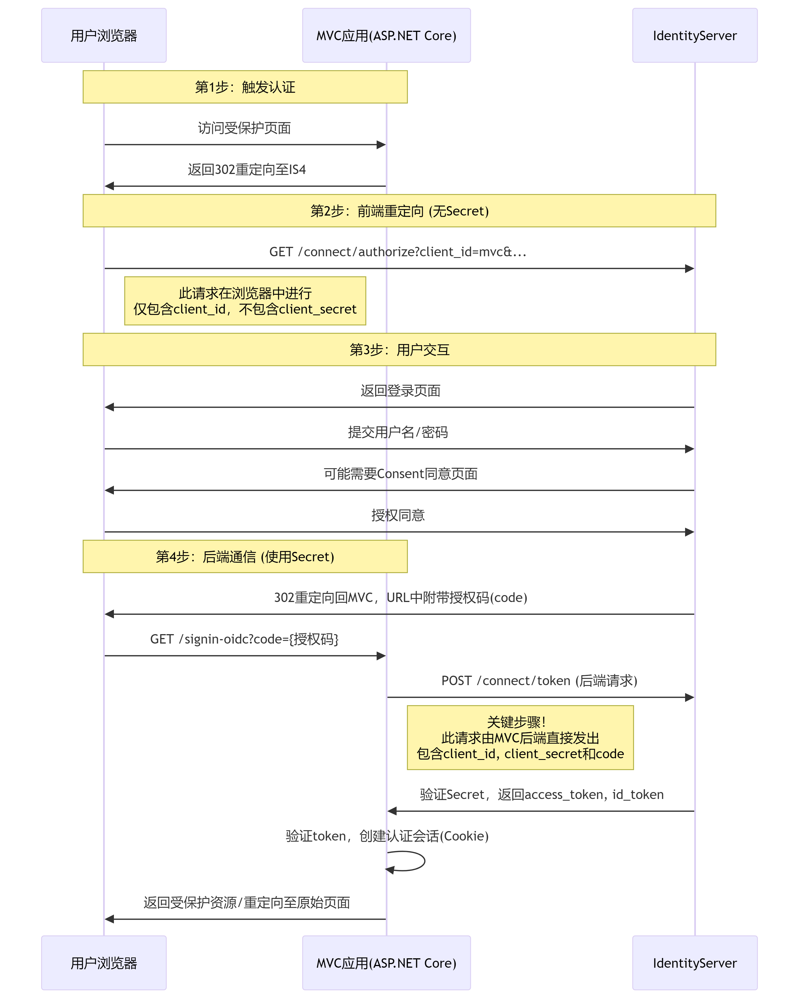

# 基于角色 认证时候 认证中心的 client 定义 和 API 端的 设置问题需要理解下

# 基于角色认证的时候 如何发送 scope 参数去申请 token

对于基于角色的认证（RBAC），你仍然需要请求 openid 和 role 这两个关键的 Identity Scopes，但不需要请求具体的 API Scopes（如 contact.read）。

&scope=openid profile role gateway_api user_api
详细解释:

1. 为什么需要 openid 和 role？
   openid：这是必须的，它告诉 IdentityServer 这是一个 OpenID Connect 请求，会返回 sub (Subject ID) 声明。

role：这是最关键的！它告诉 IdentityServer："我想要用户的角色信息"。没有这个 scope，即使你的 SmsAuthCodeValidator 中添加了角色 Claim，IdentityServer 也不会将其放入 Token 中。

2. 基于角色 vs 基于 Scope 的请求对比

```
认证方式	          目的	            请求的 Scopes 示例	                                Token 中的内容
基于 Scope (原有)	  控制API访问权限	openid profile contact.read gateway_api	              scope: ["contact.read", "gateway_api"] + 用户信息

基于 Role (新增)	  控制用户角色权限	 openid role profile gateway_api	                role: ["ContactAdminRole"] + 用户信息

混合模式	         同时控制两者	     openid profile role contact.read gateway_api	    scope: ["contact.read"] + role: ["ContactAdminRole"] + 用户信息
```

3. 你的代码示例分析
   你在 SmsAuthCodeValidator 中硬编码了角色
   claims.Add(new Claim(JwtClaimTypes.Role, "ContactAdminRole"));
4. 网关配置的注意事项
   在你的网关配置中，基于角色的路由不需要在 AuthenticationOptions 中指定 AllowedScopes，因为认证是基于角色而不是 API Scope。

# 只需要加 role 吗，并没有说明是什么角色呀

你说得非常对！这是一个非常重要的概念澄清。是的，只需要加 role，不需要在请求中指定具体是什么角色。

核心概念：声明（Claim） vs 范围（Scope）
让我用个比喻来解释：

- Scope（范围）：就像是你去餐厅点餐。你告诉服务员："我要一份牛排"（contact.read）、"还要一份沙拉"（profile）。服务员（IdentityServer）就会把你点的菜（Claims）端上来。

- Claim（声明）：就像是餐厅给你上菜。服务员端上来的是"西冷牛排"（ContactAdmin 角色）、"凯撒沙拉"（用户信息）。你不能点"给我来一份西冷牛排"，你只能点"我要一份牛排"，然后厨师（你的业务逻辑）决定给你什么牛排。

IdentityServer 的响应：

然后 IdentityServer 会：

1. 检查用户是否有访问这些范围的权限

2. 调用你的 SmsAuthCodeValidator 和 ProfileService

3. 你的代码决定这个用户有什么具体角色（比如 ContactAdminRole）

4. 将这些角色信息放入 Token

为什么这样设计？
安全：客户端不应该知道用户有什么角色，这是服务器的权限。

解耦：客户端不需要关心权限管理的细节，只需要知道自己需要什么类型的信息。

动态性：用户的角色可能会变化，但客户端的请求不需要变化。

## 所以总结来说：客户端只说要"角色信息"（role scope），而你的服务器代码决定给什么具体的角色（如 ContactAdminRole）。这就是 RBAC 的工作方式！

# 那岂不是又多少角色用的就需要加多少 client 了，

完全不是这样的！你不需要为每个角色创建不同的客户端！

# 关键安全机制：客户端身份验证

1. Client Secret 验证（第一道防线）
2. 请求来源验证（第二道防线）
   对于机密客户端，IdentityServer 还会验证请求的来源：

```
new Client
{
    ClientId = "android",
    ClientSecrets = { new Secret("secret".Sha256()) },
    AllowedGrantTypes = { "sms_code" },
    AllowedScopes = { /* ... */ },

    // 限制允许的重定向URL
    RedirectUris = { "https://myapp.com/callback", "myapp://callback" },

    // 限制允许的CORS来源
    AllowedCorsOrigins = { "https://myapp.com" }
}
```

3. 客户端类型验证（第三道防线）

```

// 机密客户端（Web应用） - 需要secret验证
new Client
{
    ClientId = "web_app",
    ClientSecrets = { new Secret("web_secret".Sha256()) },
    RequireClientSecret = true,  // 必须提供secret
    AllowedGrantTypes = { "authorization_code" }
}

// 公共客户端（移动APP） - 有额外保护
new Client
{
    ClientId = "android_app",
    RequireClientSecret = false,  // 移动APP无法安全存储secret
    AllowedGrantTypes = { "sms_code" },
    RedirectUris = { "myapp://callback" }  // 只能用特定的deep link
}

// 设备客户端（IoT设备） - 又有不同规则
new Client
{
    ClientId = "iot_device",
    AllowedGrantTypes = { "device_flow" },
    // 特殊的安全限制...
}
```

# 那我有一个问题，获取 token 的时候，secret 这也是发送请求时候发作为 post 请求发了出去了呀，这岂不是很不安全

在你描述的从访问受保护的 API 到被重定向至认证中心（IdentityServer）进行登录授权，并出现同意（consent）页面的过程中，客户端密钥（Client Secret）的沟通主要发生在后端服务之间的安全通信中，而不是在浏览器与认证服务器的前端交互里。这个过程通常涉及授权码流程（Authorization Code Flow），其中 Client Secret 用于证明客户端身份。



# 好滴基于角色的认证我理解了，用户只需要发送 带 role 的 scope 参数就可以了，服务器决定用户是什么 role，这个很好理解。 那我们再回到 scope 的认证上去，scope 认证是怎么保证 客户的权限的呢，scope 参数 中，用户可以可以随意指定 openid profile gateway_api user_api contact.read 的呀

答案是：用户（或者说客户端）不能随意指定任何 scope，只能请求在 IdentityServer 中预先为该客户端注册时允许的 scope

# 这我是理解的，client 中已经预定义了 AllowedScopes，我是理解的，但是 scope 也是有限制才对呀，比方说 一些用户只能有写，管理的权限，难道这是 scope 认证的限制吗

核心区别：控制对象不同
基于 Scope 的认证：控制的是客户端应用（Client） 能做什么

基于角色的认证：控制的是用户（User） 能做什么

您问的"一些用户只能有写，管理的权限"这个问题，正是基于角色的认证要解决的问题，而不是 Scope 认证要解决的问题。

Scope 认证的限制是什么？
Scope 认证的限制在于：它只能控制"什么应用能做什么事"，而不能控制"什么用户能做什么事"。

如何实现"某些用户只能有特定权限"？
这正是需要角色系统的原因！

# 总结

您提出的问题正好说明了为什么在实际系统中，我们通常需要 Scope 和 Role 的结合：

1. Scope 认证：解决"这个应用是否被允许请求这些权限？"

由 IdentityServer 在颁发 Token 时验证

通过客户端的 AllowedScopes 配置控制

2. 角色认证：解决"这个用户是否被允许执行这个操作？"

由 API 端在处理请求时验证

通过业务逻辑和用户角色控制

所以回答您的问题：单纯的 Scope 认证无法限制特定用户的权限，它只能限制特定客户端的权限。要限制用户的权限，必须引入角色系统。

# 基于角色认证了，我理解就可以不用 Scope 认证的方式了话，那 audience 验证还有什么用途

# 遇到一个很典型的问题，api gateway 中添加的 scope，需要在申请 token 时候包含进去，否则会出 403 ，在 gateway 时候就会被拦截了

openid profile gateway_api role contact.read contact_api contact.write

# 服务之间的调用不会验证 audience 吗

# 微服务之间调用，认证问题

当前的项目情况是

# 需要验证下 postman 请求一个微服务 ，如何验证 audience 的
